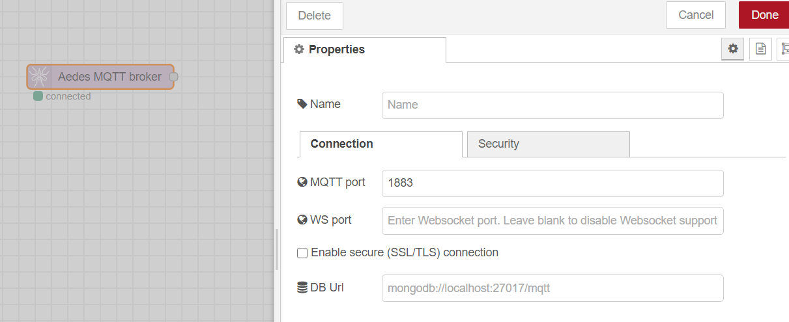
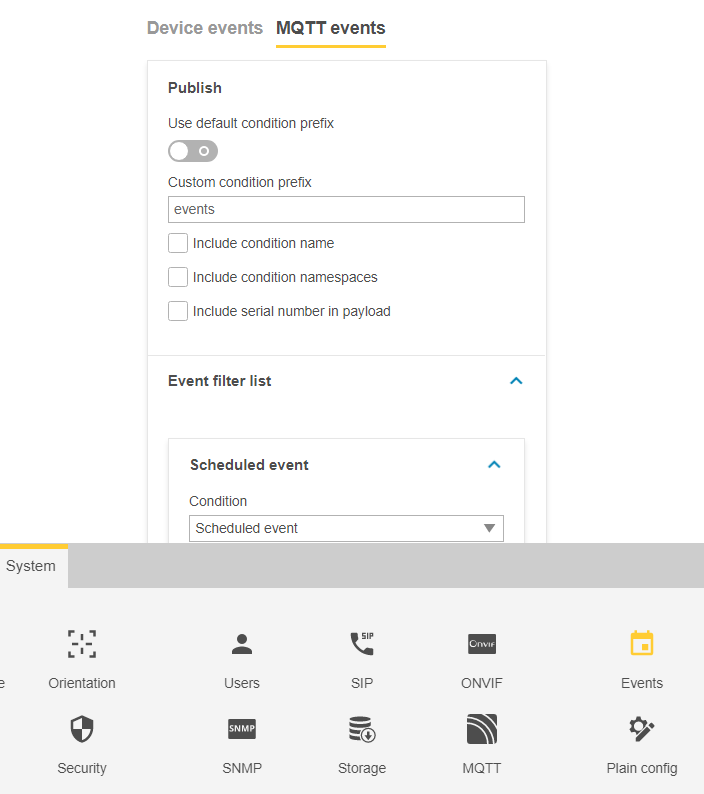
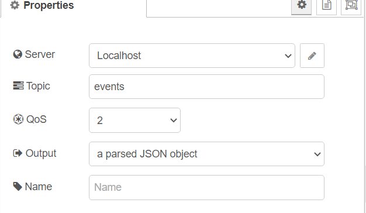
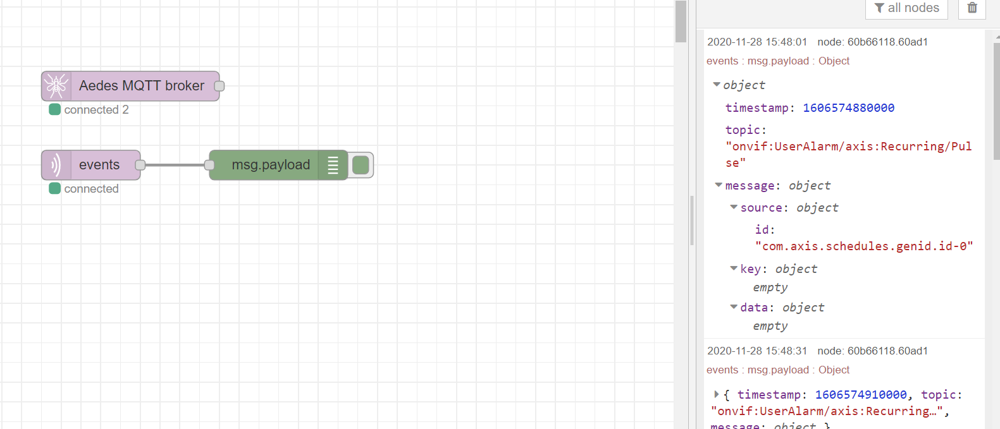

# Camera Event Monitoring

## Overview

This example describes how to get events from the camera into Node-Red flows to be used in a Node-Red flow.

Axis cameras (and ACAPs) may generate events and data that may be used for triggering actions and notifications.  A video management system will typically use the ONVIF event stream to recive these events.
An alternative (and simpler) way is to use MQTT.  Camera firmware 10.0 and later includes an MQTT client.

For MQTT to work there must be an MQTT broker.  The broker is typically installed on a local computer or as public service.
With the Node-Red ACAP installed it is possible to have Node-Red act as a local MQTT broker that the camera client and the Node-Red 
client can connect to.

## PREREQUISITES
- Axis camera with firmware 10.0 or later
- Node-Red server (installed in camera or a local computer)

## MQTT Broker

If there is already an MQTT broker available on the network you may use that.  If you want to run the MQTT broker in the camera you need to 
import the AEDES node ( [node-red-contrib-aedes](https://flows.nodered.org/node/node-red-contrib-aedes) ) into Node red.  Don't forget to 
configure the broker to require user and password in the tab "Security".

## Camera MQTT Client

Note: An alternative to the camera MQTT client is to use Axis Integration Team [Axis Publisher](https://github.com/aintegration/acaps/tree/master/Publisher)

Configure the camera MQTT client to connect to the local MQTT broker.  You need set the cameras IP as the "localhost" is not accepted.

## Camera Event Publishing

You need to setup MQTT publish in the camera under *Events | MQTT Events*.

Recommeded settings:
- Disable default condition prefix.
- The "Custom condition prefix" is the MQTT topic.  This example will use "events".
- Disable include condition name
- Disable condition namepsace
- Disabel serial number in payload
- Add the event that you want to monitor.  

## Node-Red MQTT Client (subscription)
In Node-Red, move an MQTT subscription node into workspace.  Double click and "Add mqtt-broker"  Set server to "localhost".  
Under the the security, set the user/password you defined in the broker.  Click "Update"

Set topic to "events" and set output to "a parsed JSON object"

## Node-Red Output

Example camera event publish to a debug output.

