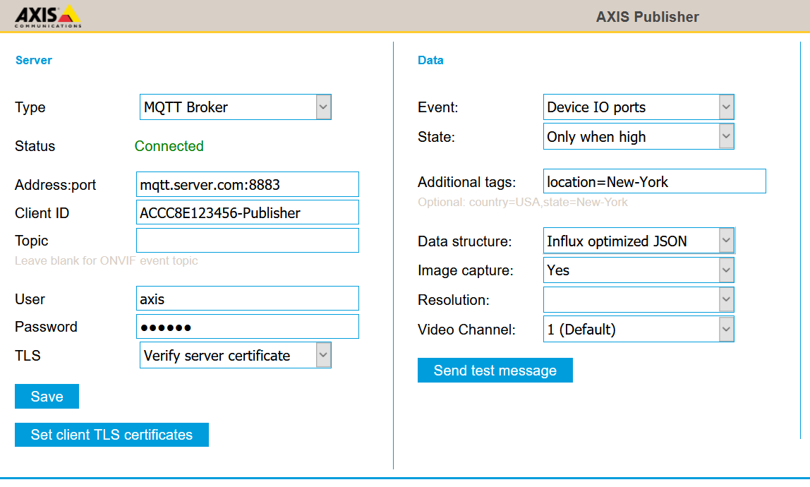
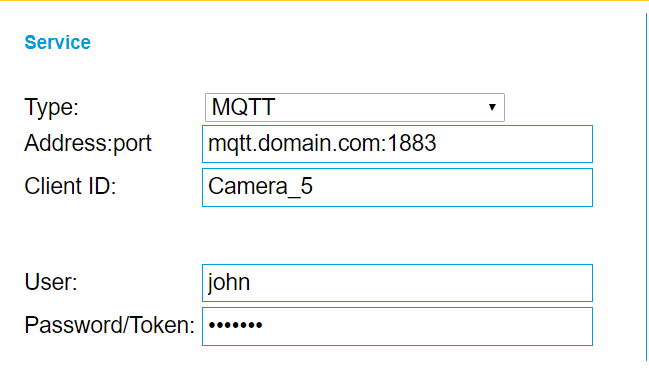

# Axis Publisher 1.2-1


Getting event data payload from an ACAP can be a challange.  The common way is to connect to the VAPIX/ONVIF event stream which requires an RTSP stream with authentication.  Publish decouples the data producing device and push the data to a consuming services. 

Publisher will send supported event payload to MQTT, Influx Database or a HTTP Server.  An optional JPEG image (upon event detection) may be included in the data payload.

### Prerequisites
1. Axis Camera
2. An Influx server, HTTP server or MQTT Broker

### Supported platforms
- [MIPS](https://github.com/aintegration/acaps/raw/master/Publisher/files/Axis_Publisher_mips.eap)
- [ARMv7hf](https://github.com/aintegration/acaps/raw/master/Publisher/files/Axis_Publisher_armv7hf.eap)
- [AARCH64](https://github.com/aintegration/acaps/raw/master/Publisher/files/Axis_Publisher_aarch64.eap)

### Supported Anlytics Producers
- Event payload from generic ACAP events
- Event payload from generic device events
- Axis VMD4
- Axis Direction Detection
- Axis License Plate Verifier
- Axis Barcode Reader

### Payload data structures
Additional target information and examples of payload structures.
* [HTTP](https://github.com/aintegration/publisher/blob/master/http.md)
* [MQTT](https://github.com/aintegration/publisher/blob/master/mqtt.md)
* [Influx DB](https://github.com/aintegration/publisher/blob/master/influx.md)

# Configuration



### Service Type
Select MQTT, HTTP or Influx

### Address:port
Set the server address of target

Examples
```
  mqtt.server.com:1883
  12.23.34.45/some/end/point
  influx.server.com:8086
```
### Client ID
Set a name for the device used primaruly for MQTT.  This will also be added in the data payload.

### Authentication
- None - No authentication will be done regardless if user/password is set
- Basic - Influx supports basic
- Digest (encrypted passwords) - Many web servers supprts digest authentication.
- Beare/Token.  Set you token in the password field.  This will append HTTP header "Authorization: Bearer myToken"

### HTTPS/TLS
If the server requires HTTPS, set value other than "No".  This will append "https://" to the address.
If the server has a self-signed or private CA certificate, select "Accept untrusted certificate".
If the server has a certificate signed by a public CA (e.g. LetsEnrypt), select "Validate certificate"

*Note that TLS is not supported for MQTT*


### Database name
If you set target to Influx you need to set the database name.  If target is MQTT or HTTP you can optional set a value to include database as a propery in the payload/body

### Topic/Collection
* MQTT: Topic is required for MQTT.
* Influx:  The topic is required for Influx as it is the measurement where data will be written to.
* HTTP:  Topic is optional for HTTP.  If set will be included as a property

### Payload
Set the event (data producer).  The event payload will be included in the published payload.

### User Tags
Sometimes additional tags that are not part of the event/producer payload.
> Note that you may not use any spaces in the key or value field (if needed, use '-' or '_')

Examples
```
location=New-York
country=France,city=Paris,store=some-id
```
For Influx the names will be added a tags.
For HTTP and MQTT the tags will be added as properties in JSON payload.

### Image
Sometimes you want to include an image when detection occured.  Setting Image will append a JPEG image on published data.  Leave blank if you do not want an image.  The image will be base64 encoded in the payload.

> Note that images takes up a lot of storage space.  It is recommended to use a medium size resolution, typical 640x360 (16:9), 640x480 (4:3) or 640x640 (1:1) depending on the camera aspect ration.

Image syntax
```
resolution=640x360
```


### Save configuration
When applying configuration there will message on success and failure

### Test connection
This will publish test data to the target and display a success/failure message.  On failure, check the log for hints.
